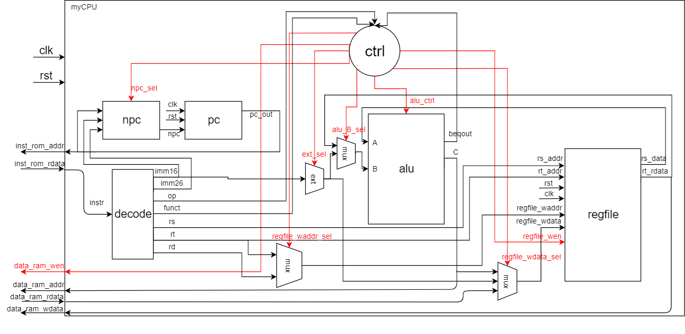

# 单周期实验流程指导

## MIPS 简介
[MIPS](https://www.mips.com/) 架构（Microprocessor without Interlocked Pipeline Stages architecture）是一种采取精简指令集的处理器架构，广泛被使用在许多电子产品、网络设备、个人娱乐设备与商业设备上。目前 MIPS 包括 32 位架构和 64 位架构，本实验实现的是 32 位架构下的若干条指令。摘自[维基百科](https://zh.wikipedia.org/zh-cn/MIPS%E6%9E%B6%E6%A7%8B)。

相关资源如下：

[MIPS 指令集手册](https://www.mips.com/downloads/the-mips32-instruction-set-v6-05/)

[其他 MIPS 相关资源下载](https://www.mips.com/downloads/)

本实验只需使用 MIPS 指令集手册即可。

## SOC 简介
[SOC](https://zh.wikipedia.org/wiki/%E7%B3%BB%E7%BB%9F%E8%8A%AF%E7%89%87)（System on Chip）是系统级芯片的英文简称，现代处理器芯片并不只包含有一个 CPU，相反除了 CPU 之外还有其他很多部件以增强芯片功能，而其中 CPU 只是起到一个计算、控制的作用，类似于人的大脑，而系统级芯片更像是一个完整的人。除 CPU 外系统级芯片一般还会包括存储器（Flash，RAM，ROM等），用于提供脉冲的振荡器，一系列的外部设备即外设等。越复杂的系统级芯片自然功能也就越强大。

在本实验中，只需要关注核心的 MIPS 单周期 CPU 的实现，在实验代码中已经写好了一些简单外设的控制器，以及一个简单的 SRAM 总线，同时也使用 IP 核创建了一个指令存储器和一个数据存储器，其中指令存储器（相当于ROM）用来存储即将运行的指令程序，它是只读的；数据存储器（相当于RAM）是用来存储程序运行过程中的数据，它是可读可写的。

因此，在实现单周期 CPU 的过程中，只需要按照指定接口和时序来实现，然后将其挂在总线之上，那么该 CPU 即可对外设可存储器进行读写，然后运行指令程序就可以实现一定的功能，包括对外设的控制。

## 单周期简介
单周期 CPU 简单来说就是一个周期内执行完一条指令的 CPU，对于这类 CPU 来说，每条指令的完成只需要一个周期，那么 CPU 的频率就只能根据那条执行时间最长的指令来设置。因此，这类 CPU 的频率不会很高，效率也很低。但是对于本实验来说，只需要实现 7 条简单指令，同时存储器是采用 Distributed Memory Generator IP 核来生成的（使用该 IP 核生成指令和数据存储器时读取是无延时的，即本周期发出读写命令本周期即返回结果），因此一般情况下，即使使用精工开发板板载时钟 100MHz 也是可以的，无需再降频。

对于精工开发板来说，100MHz 意味着每条指令的执行周期都是小于 1/100MHz，即 10ns。以一条 LW 指令的执行为例，首先需要根据 pc 值在指令存储器取出该 LW 指令，接着会解析该指令识别出是 LW 指令，LW 指令是访存指令因此需要计算出访存地址，然后根据该地址访问数据存储器或外设，最后将取回的数据写到寄存器堆中。这一系列的操作需要在一个周期内完成，而不同的指令操作是不同的，但都需要在一个周期内完成。

## 本实验指导

### 整体架构
本实验整个项目工程的架构图如下：


其中，做实验时只需要完成 myCPU 部分的代码即可，其他部分代码已补充完毕。在实现 myCPU 时需要将其最终的对外接口符合下面的接口定义。

**关于数据存取：**

MIPS 架构是一个统一编址的指令集架构，即没有 `IN`、 `OUT` 这类访问外设的指令。MIPS 架构是将地址空间中的一部分地址分配给 I/O 端口，这样在访问外设时跟访问数据存储器是相同的操作，即都是使用 LW、LW 这类访存指令来访问，因此读写外设和数据存储器是没有区别的。

因而上述架构图中会有一个 `bridge` 模块，该模块是用来确定读写的是数据存储器还是外设。该模块的工作原理就是通过地址来区分，本实验中，设定外设的地址空间是 **`0xbfaf_0000 ~ 0xbfaf_ffff`**，因此，当访存指令给出的访问地址是在该范围内时即说明要访问外设，`bridge` 会控制外设读写而不是数据存储器，反之亦然。 

### 接口定义
myCPU 模块对外接口如下：

|信号|方向|位宽|含义|
|-|-|-|-|
|rst|input|1|复位信号|
|clk|input|1|时钟信号|
|inst_rom_addr|output|32|取指地址|
|inst_rom_rdata|input|32|取到的指令|
|data_ram_addr|output|32|访存地址|
|data_ram_wdata|output|32|访存写数据|
|data_ram_wen|output|1|访存写使能，置 1 为写使能|
|data_ram_rdata|input|32|访存读数据|

控制信号主要为 `rst` 和 `clk` 信号，其中一个提供复位信号，一个提供时钟信号以同步 CPU。

在取指这一部分有两个信号，`inst_rom_addr` 提供当前需要取出的指令的地址，这是一个 32 位的地址，而 `inst_rom_rdata` 是**同周期**内取回的指令数据，也是 32 位（MIPS 指令是定长指令，都是 32 位）。

在访存部分有如下几个信号，`data_ram_addr` 提供访存的地址，加载和存储指令复用该信号作为访存地址。`data_ram_wdata` 提供存储指令将要存储的数据，当访存指令为加载指令时该信号不起作用。`data_ram_wen` 在访存指令为存储指令时置高电平，表示将写存储器，其他情况置低电平。`data_ram_rdata` 是访存指令为加载指令时**同周期**返回的一个加载数据，即 LW 等指令从存储器中读取到的数据。

### 数据通路
一个可参考的数据通路如下图所示：



上图中黑色的线是数据信号线，红色的线是控制信号线，供 8 个控制信号。注：可将本文档同目录下的 `single_cycle.drawio` 文件用 draw.io 网站打开，可编辑该图。

根据上图数据通路，浅析一条 LUI 指令的实现过程如下：

- 首先，在时钟上升沿 `pc` 模块输出本条指令 pc 值，即指令的地址，通过该 pc 值可从指令存储器取出该 LUI 指令，本条指令会被译码，产生 op、funct 等信号
- 控制模块根据输入产生相关的控制信号，对于 LUI 指令，`ext_sel` 控制信号会控制本条指令的 16 位立即数进行扩展（即 imm16 填充 32 位数据高 16 位，低 16 位补 0）；`regfile_wdata_sel` 控制信号会控制最终写入寄存器堆的数据位 16 位立即数的扩展；`regfile_waddr_sel` 会控制寄存器写入地址位 `rt`;等等具体每个控制信号值如下表：

|控制信号<br>指令|npc_sel|ext_sel|alu_B_sel|alu_ctrl|data_ram_wen|regfile_wen|regfile_waddr_sel|regfile_wdata_sel|
|-|-|-|-|-|-|-|-|-|
|LUI|00|10|1|3'b000|0|1|1|10|
|ADD|00|00|0|ALU_ADD|0|1|0|00|
|ORI|00|01|1|ALU_OR|0|1|1|00|
|LW|00|00|1|ALU_ADD|0|1|1|01|
|SW|00|00|1|ALU_ADD|1|0|0|00|
|BEQ|10|00|0|ALU_SUB|0|0|0|00|
|J|01|00|0|000|0|0|0|00|

```
注：
* npc_sel 为 00 指 pc 值顺序加 4，为 01 将直接跳转，为 10 将相对跳转
* ext_sel 为 00 将对 16 位立即数进行符合扩展，为 01 进行零扩展，为 10 则将其置高 16 位
* alu_B_sel 为 0 则选择 rt_rdata 作为 B 操作数，否则选择 16 位立即数的扩展结果作为 B 操作数
* alu_ctrl 为 ALU_ADD 时指 alu 将进行加法操作，其他同理。为 000 不进行运算。具体 ALU_ADD 这些是宏定义，参考 defines.vh 查看具体定义值
* data_ram_wen 为 1 则写数据寄存器
* regfile_wen 为 1 则写寄存器堆
* regfile_waddr_sel 为 1 则选择 rt 作为寄存器堆的写地址，否则 rs 作为写地址
* regfile_wdata_sel 为 00 则 alu 运算结果作为寄存器堆写数据，为 01 时数据存储器的读数据作为写数据，为 10 时 16 位立即数的扩展结果作为写数据

上述赋值只是一个参考，可以根据情况自行修改，例如添加 AND 指令，alu_ctrl 就需要添加一个值来控制 alu 进行与操作。
```

- 在一个时钟上升沿时，`regfile` 模块根据输入的写数据，写地址即将数据写入寄存器堆。
- 本条指令的执行并不使用到 `alu` 模块，但是 `alu` 模块内部还是会有相关执行，只是最终不使用它的执行结果罢了。

### 测试用例说明
测试用例包括两个，都是使用 MIPS 汇编编写，具体代码参看实验代码 lab3 下的 soft 目录。

```
- lab3
    - single_cycle
    - soft
        - adder8bit.S       8 bit 加法器的汇编实现
        - adder8bit.coe     汇编代码转换的 coe 文件
        - fibonacci.S       斐波拉契数列计算及显示的汇编实现
        - fibonacci.coe     汇编代码转换的 coe 文件
```

#### 8 bit 加法器
该汇编代码只使用到了本实验中实现的 7 条指令，代码功能如下：

- 使用拨码开关作为两个加数的输入，8 个拨码开关可以生成一个 8 bit 的数（每位拨上为 1，拨下为 0）
- 调整好拨码开关后，按下 `UP` 按钮则此时拨码开关状态转换的数作为第一个加数，按 `RIGHT` 按钮则此时拨码开关状态转换的数作为第二个加数。按下 `MID` 按钮则计算出两个加数相加的结果并在数码管显示
- 一次计算的结果会赋值给第一个加数

#### 斐波拉契数列计算及显示
该汇编代码只使用到了本实验中实现的 7 条指令，代码功能如下：

- 该汇编代码会计算斐波拉契的前 22 项，其中第 1 项和第 2 项都是 1，需要计算得到的是第 3 项到 22 项，即 2，3，5，... 17711，并将这 20 项存储到数据存储器
- 最后程序会再从数据存储器取出数据，并将数据逐个通过数码管显示

**关于数据存储器**

在本实验中数据存储器的大小是 4K Byte，即实际的物理空间所占用的地址只有 `0x000 ~ 0xfff`，但是 MIPS 的地址空间是 `0x00000000 ~ 0xffffffff`，因此需要将虚拟地址往物理地址映射，本实验是采用线性映射的方式，即虚拟地址 `0xaaaaaxxx` 会被映射到物理地址 `0x00000xxx`。

斐波拉契数列计算的实验代码中使用到了一个 `0xbfc1_0000` 作为存储斐波拉契数列的首地址，该地址即是一个虚拟地址，通过映射该地址为 `0x000`，即第一项将存储在数据存储器的第一个字的位置。

