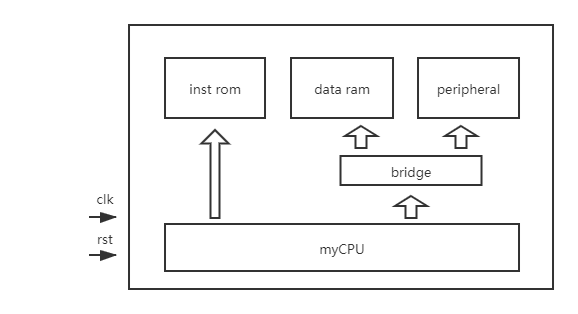

# 单周期实验流程指导

## MIPS 简介
[MIPS](https://www.mips.com/) 架构（Microprocessor without Interlocked Pipeline Stages architecture）是一种采取精简指令集的处理器架构，广泛被使用在许多电子产品、网络设备、个人娱乐设备与商业设备上。目前 MIPS 包括 32 位架构和 64 位架构，本实验实现的是 32 位架构下的若干条指令。摘自[维基百科](https://zh.wikipedia.org/zh-cn/MIPS%E6%9E%B6%E6%A7%8B)。

相关资源如下：

[MIPS 指令集手册](https://www.mips.com/downloads/the-mips32-instruction-set-v6-05/)

[其他 MIPS 相关资源下载](https://www.mips.com/downloads/)

本实验只需使用 MIPS 指令集手册即可。

## SOC 简介
[SOC](https://zh.wikipedia.org/wiki/%E7%B3%BB%E7%BB%9F%E8%8A%AF%E7%89%87)（System on Chip）是系统级芯片的英文简称，现代处理器芯片并不只包含有一个 CPU，相反除了 CPU 之外还有其他很多部件以增强芯片功能，而其中 CPU 只是起到一个计算控制的作用，类似于人的大脑，而系统级芯片更像是一个完整的人。除 CPU 外系统级芯片一般还会包括存储器（Flash，RAM，ROM等），用于提供脉冲的振荡器，一系列的外部设备即外设等。越复杂的系统级芯片自然功能也就越强大。

在本实验中，只需要关注核心的 MIPS 单周期 CPU 的实现，在实验代码中已经写好了一些简单外设的控制器，以及一个简单的 SRAM 总线，同时也使用 IP 核创建了一个指令存储器和一个数据存储器，其中指令存储器（相当于ROM）用来存储即将运行的指令程序，它是只读的；数据存储器（相当于RAM）是用来存储程序运行过程中的数据，它是可读可写的。

因此，在实现单周期 CPU 的过程中，只需要按照指定接口和时序来实现，然后将其挂在总线之上，那么该 CPU 即可对外设可存储器进行读写，然后运行指令程序就可以实现一定的功能，包括对外设的控制。

## 单周期简介
单周期 CPU 简单来说就是一个周期内执行完一条指令的 CPU，对于这类 CPU 来说，每条指令的完成只需要一个周期，那么 CPU 的频率就只能根据那条执行时间最长的指令来设置。因此，这类 CPU 的频率不会很高，效率也很低。但是对于本实验来说，只需要实现 7 条简单指令，同时存储器是采用 Distributed Memory Generator IP 核来生成的（使用该 IP 核生成指令和数据存储器时读取是无延时的，即本周期发出读写命令本周期即返回结果），因此一般情况下，即使使用精工开发板板载时钟 100MHz 也是可以的，无需再降频。

对于精工开发板来说，100MHz 意味着每条指令的执行周期都是小于 1/100MHz，即 10ns。以一条 LW 指令的执行为例，首先需要根据 pc 值在指令存储器取出该 LW 指令，接着会解析该指令识别出是 LW 指令，LW 指令是访存指令因此需要计算出访存地址，然后根据该地址访问数据存储器或外设，最后将取回的数据写到寄存器堆中。这一系列的操作需要在一个周期内完成，而不同的指令操作是不同的，但都需要在一个周期内完成。

## 本实验指导

### 整体架构
本实验整个项目工程的架构图如下：

其中，做实验时只需要完成 myCPU 部分的代码即可，其他部分代码已补充完毕。在实现 myCPU 时需要将其最终的对外接口符合下面的接口定义。

**关于数据存取：**

MIPS 架构是一个统一编址的指令集架构，即没有 `IN`、 `OUT` 这类访问外设的指令。MIPS 架构是将地址空间中的一部分地址分配给 I/O 端口，这样在访问外设时跟访问数据存储器是相同的操作，即都是使用 LW、LW 这类访存指令来访问，因此读写外设和数据存储器是没有区别的。

因而上述架构图中会有一个 `bridge` 模块，该模块是用来确定读写的是数据存储器还是外设。该模块的工作原理就是通过地址来区分，本实验中，设定外设的地址空间是 **`0xbfaf_0000 ~ 0xbfaf_ffff`**，因此，当访存指令给出的访问地址是在该范围内时即说明要访问外设，`bridge` 会控制外设读写而不是数据存储器，反之亦然。 

### 接口定义
myCPU 模块对外接口如下：

|信号|方向|位宽|含义|
|-|-|-|-|
|rst|input|1|复位信号|
|clk|input|1|时钟信号|
|inst_rom_addr|output|32|取指地址|
|inst_rom_rdata|input|32|取到的指令|
|data_ram_addr|output|32|访存地址|
|data_ram_wdata|output|32|访存写数据|
|data_ram_wen|output|1|访存写使能，置 1 为写使能|
|data_ram_rdata|input|32|访存读数据|

控制信号主要为 `rst` 和 `clk` 信号，其中一个提供复位信号，一个提供时钟信号以同步 CPU。

在取指这一部分有两个信号，`inst_rom_addr` 提供当前需要取出的指令的地址，这是一个 32 位的地址，而 `inst_rom_rdata` 是**同周期**内取回的指令数据，也是 32 位（MIPS 指令是定长指令，都是 32 位）。

在访存部分有如下几个信号，`data_ram_addr` 提供访存的地址，加载和存储指令复用该信号作为访存地址。`data_ram_wdata` 提供存储指令将要存储的数据，当访存指令为加载指令时该信号不起作用。`data_ram_wen` 在访存指令为存储指令时置高电平，表示将写存储器，其他情况置低电平。`data_ram_rdata` 是访存指令为加载指令时**同周期**返回的一个加载数据，即 LW 等指令从存储器中读取到的数据。

### 数据通路
一个可参考的数据通路如下图所示：

根据上图数据通路，浅析一条 LUI 指令的实现过程如下：

### 测试用例说明

