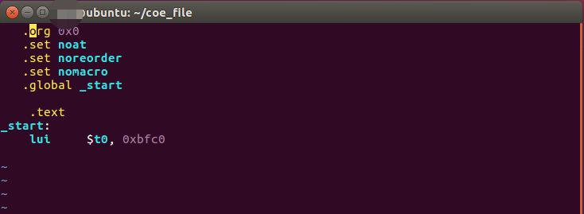

# 交叉编译工具链安装及使用

## 安装步骤

1. 首先主机需要有 Linux 环境，可以是双系统也可以是虚拟机。Linux 环境建议使用 Ubuntu16.04，目前来说在 Ubuntu16.04 下使用还没有出现较大的问题，网上有些博客说 Ubuntu18.04 可能会有问题。
    - 注：不要使用 wsl，要安装的交叉编译工具链是32位程序，而 wsl 目前只支持运行64位程序。

2. 在 linux 命令行下，然后使用如下命令下载
    ```
    wget http://ftp.loongnix.org/toolchain/gcc/release/gcc-4.3-ls232.tar.gz
    ```

3. 解压
    ```
    sudo tar –zxvf gcc-4.3-ls232.tar.gz -C /
    ```

4. 设置环境变量 PATH
    ```
    echo "export PATH=/opt/gcc-4.3-ls232/bin:$PATH" >> ~/.bashrc
    source ~/.bashrc
    ```

如果机器是64位的机器还需执行如下命令
```
sudo apt-get install lsb-core 
```

完成上述工作后，可以输入 `mipsel-linux-gcc -v`，如果可以看到有版本号输出，说明配置正确。

## 使用

使用方式同 gcc，可以结合 [coe](https://github.com/bit-mips/bitmips_experiments/tree/master/tools/coe%20tool) 工具使用。

## 关于指令生成

初期在对 CPU 进行测试时会写一些指令来测试 CPU 的正确性。指令的生成方式有很多，如下介绍几种方式：

- 根据指令集手册来手动编写
    - 这是一种较为“低级”的方式，但却又行之有效。在对交叉编译工具链等软件不熟悉的情况下，这种方式快速写出若干条指令，用以检测 CPU 的某些功能。
    - 示例：lui 指令的编码规则为`op`字段固定为 `001111`，`rs`字段固定为`00000`，`rt`字段为目标寄存器地址，bit 15~0 为16位的立即数，那么想要将数据`0xbfc0_0000`加载到寄存器 `$8`则可编写如下指令（小端）
    ```
    Bin 00111100 00001000 10111111 11000000
    Hex 3c08bfc0
    ```
- 通过一些脚本语言辅助编写
    - 上述的方式很简单，在编写几条指令时行之有效，但是需要批量的指令，且指令单一（仅若干比特位不同）时就不太奏效。此时可以使用 python 等脚本语言编写。
    - 示例：
    ```
    # rt我为整数，imm16为16进制字符串且格式为 0x**
    def lui_gen(rt, imm16):
        return "001111" + "00000" + '{:05b}'.format(rt) + '{:016b}'.format(int(imm16, 16))

    print(lui_gen(8, '0xbfc0')) # 00111100000010001011111111000000
    ```

- 通过 Mars 等软件来生成
    - Mars 是一个可执行 jar 包，运行之后可以在其编辑区域编写 MIPS 汇编代码，之后可以利用该软件来生成相应的指令的16进制编码。（貌似不能导出，只能复制粘贴？）

- 通过交叉编译工具链来生成
    - 当使用交叉编译工具链时，指令码的生成就尤其灵活，由于交叉编译工具链及其强大，可以先编写汇编或 C 代码，然后经工具编译及相关操作，最后生成指令编码。通常使用过程中可配合 makefile 和链接脚本使用。下面介绍通过汇编代码和 [coe](https://github.com/bit-mips/bitmips_experiments/tree/master/tools/coe%20tool) 工具生成指令编码。
    - 一般，我们会将汇编代码转换为 coe 格式文件，之后将 coe 文件加载至 ip 核使用。关于 coe 文件介绍见本文最后。coe 文件的内容即是一系列的指令编码构成。通过 coe 工具可以很方便生成。
    - 该 coe 工具使用介绍如下：
        - 安装龙芯杯大赛提供的交叉编译工具链
        - 将上述压缩包在 linux 环境下解压
        - 进入该 `coe_file` 目录
        - 编辑 inst_rom.S

        
        
        - 编辑完汇编代码之后，在该目录执行 make 命令，无报错则编译成功
        
        
        
        - 查看同目录下的 `inst_rom.coe` 文件即为生成文件，包含所需指令。
        - 若出现 `./bin2coe.py: Permission denied` 错误使用如下命令解决
        ```
        chmod u+x bin2coe.py
        ```

## coe 文件说明
coe 格式文件就是一个具有特定格式的文本文件，主要用来为 ip 核初始化数据，一般可以使用 coe 格式文件来加载指令或数据。它的文本格式如下：
```
memory_initialization_radix=16;
memory_initialization_vector=
3C08BFC0,
00000000,
00000000,
00000000,
00000100,
00000000,
00000000,
00000000,
00000000,
00000000,
01200000,
05000101,
00000000,
00000000,
00000000,
00000000;
```
- memory_initialization_radix 指明数据使用的进制
- memory_initialization_vector 指明具体数据，其 "=" 后就是一条条指令十六进制编码了，如果你观察仔细可以发现第一条指令编码是 `3C08BFC0` 即代表指令 `lui $t0, 0xbfc0`

如果你不使用 ip 核加载数据，而是使用 `$readmemh()` 等函数来将数据加载至寄存器堆构造的指令或数据存储器，可以将 coe 格式文件少加修改即可使用（或者写个脚本也很方便）。

